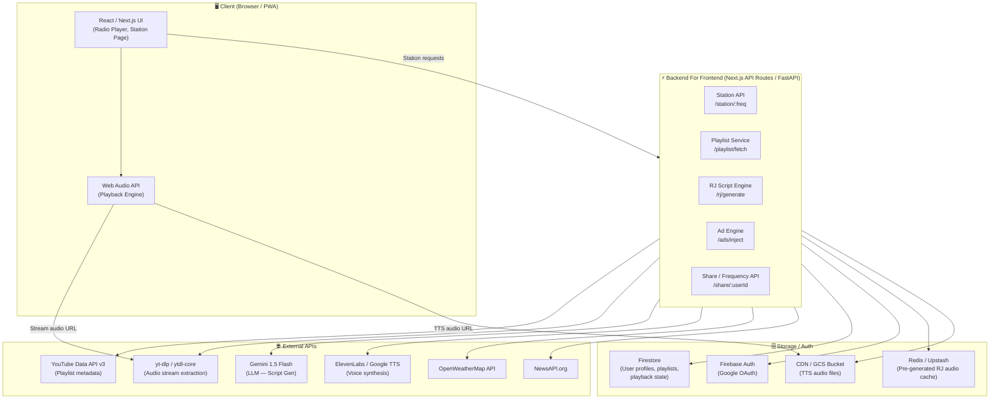
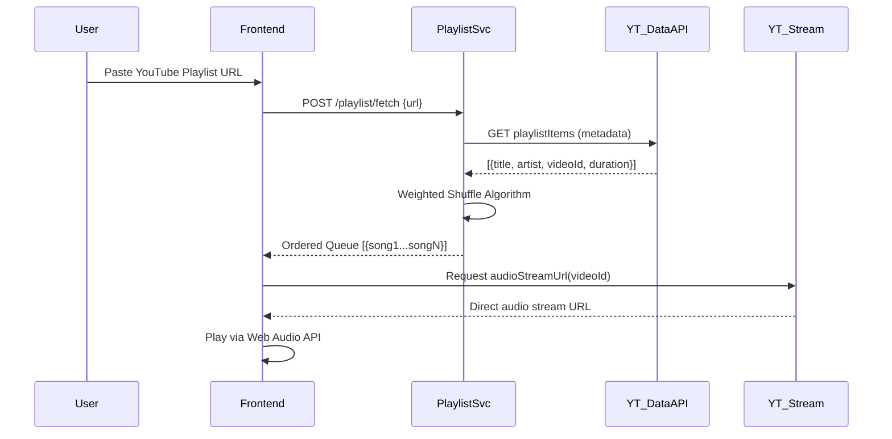
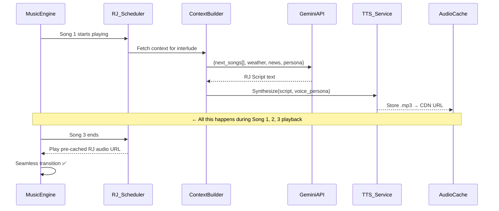
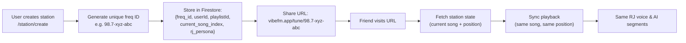
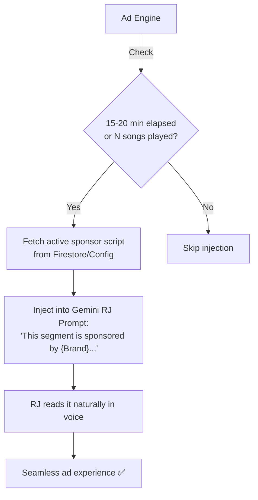
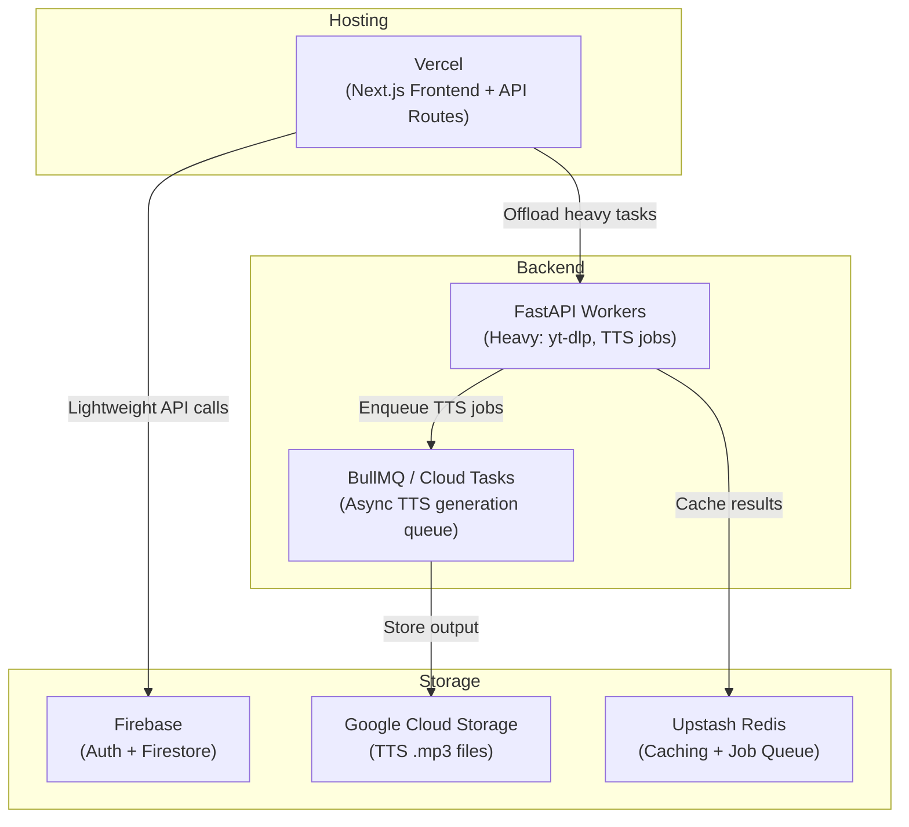
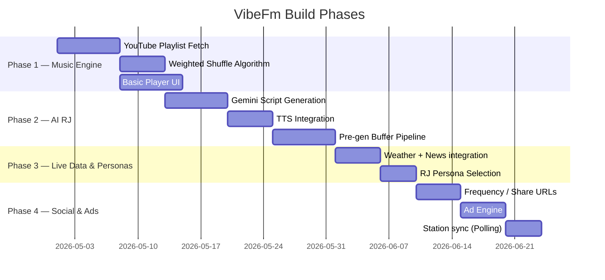

# VibeFm — System Architecture

> **Project:** AI Personal Radio Station (VibeFm / VibeCast)
> **Version:** 1.0 — Initial Architecture Proposal

---

## 1. Architecture Overview

VibeFm is built around a **real-time audio broadcast pipeline** that stitches together music audio (from YouTube), AI-generated RJ voice segments (LLM + TTS), and live data (weather, news) into a seamless, radio-like experience — personalized per user and shareable via a unique URL.

The system follows a **hybrid client-server** model:
- Heavy processing (audio fetching, LLM calls, TTS synthesis) happens **server-side**
- Playback and UI rendering happen **client-side**
- A **pre-generation buffer** ensures zero-gap transitions (key UX requirement)

---

## 2. High-Level Architecture Diagram



---

## 3. Core Subsystems

### 3.1 🎵 Music Engine

The heart of the system — fetches, queues, and streams audio from YouTube.



**Weighted Shuffle Algorithm Logic:**
```
weight(song) = 1 / (1 + times_played_recently)
             × recency_penalty(last_played_timestamp)
             × user_mood_boost (optional future feature)
```
Songs not played in the longest time get the highest weights. Implements a "Discovery within Familiarity" feel.

---

### 3.2 🎙️ AI RJ Pipeline

The most complex subsystem — generates contextual radio commentary and synthesizes voice audio **ahead of time** while music is playing.



**Gemini Prompt Architecture:**
```
System: You are {persona} — a radio host with {tone} personality.
        Keep scripts under 45 seconds. Be natural, not robotic.

Context:
  - Songs just played: [{song1}, {song2}, {song3}]
  - Up next: [{song4}, {song5}]
  - Current weather in {city}: {temp}, {condition}
  - Top news: {headline_1}, {headline_2}
  - Ad slot: {sponsor_script | null}

Generate a radio interlude script.
```

---

### 3.3 📡 Station & Sharing System

Each user gets a unique **"Frequency"** — a shareable URL that lets friends tune into your personalized station in real-time (or near real-time).



> **Note:** True real-time sync (like radio) requires a WebSocket or SSE connection to push state updates to listeners. Start with polling for simplicity.

---

### 3.4 📢 Ad Engine

Ad segments are injected as part of the RJ script — not as separate audio breaks.



---

## 4. Data Models

### User Profile (`/users/{userId}`)
```json
{
  "userId": "uid_abc123",
  "displayName": "Parth",
  "email": "parth@example.com",
  "freq_id": "98.7-xyz-abc",
  "rj_persona": "chill_indie_host",
  "news_interests": ["Tech", "Sports"],
  "location": { "city": "Mumbai", "lat": 19.07, "lon": 72.87 },
  "created_at": "2026-04-25T11:00:00Z"
}
```

### Playlist State (`/stations/{freq_id}`)
```json
{
  "freq_id": "98.7-xyz-abc",
  "owner_id": "uid_abc123",
  "playlist_url": "https://youtube.com/playlist?list=...",
  "songs": [
    { "videoId": "abc", "title": "Blinding Lights", "artist": "The Weeknd", "duration": 200, "play_count": 3, "last_played": "2026-04-24T..." }
  ],
  "current_index": 4,
  "queued_rj_audio_url": "https://cdn.vibefm.app/rj/uid_abc123_20260425.mp3",
  "last_rj_at": "2026-04-25T10:45:00Z"
}
```

### Ad Config (`/ads/active`)
```json
{
  "sponsor": "Notion",
  "script_template": "This hour is brought to you by Notion — the all-in-one workspace...",
  "active": true,
  "placement_interval_songs": 6
}
```

---

## 5. Infrastructure & Deployment



| Concern | Solution |
|---|---|
| Frontend Hosting | **Vercel** (Next.js, free tier viable) |
| API / Heavy Processing | **FastAPI on Railway or Render** (yt-dlp needs a server environment) |
| Database | **Firestore** (schemaless, real-time capable) |
| Auth | **Firebase Auth** (Google OAuth, frictionless) |
| TTS Audio Storage | **Google Cloud Storage + CDN** |
| Async Job Queue | **Upstash Redis + BullMQ** (pre-generate RJ audio) |
| Caching | **Upstash Redis** (API responses: weather, news, metadata) |

---

## 6. Key Technical Decisions & Trade-offs

| Decision | Chosen Approach | Rationale |
|---|---|---|
| **YouTube Playback** | YouTube IFrame API (not yt-dlp streaming) | ToS compliance; yt-dlp for server-side metadata only |
| **RJ Audio Pre-gen** | Async queue + CDN storage | Eliminates playback gaps (core UX requirement) |
| **LLM Model** | Gemini 1.5 Flash | Low latency + generous free quota for MVP |
| **TTS Provider** | ElevenLabs (MVP) → Google TTS (Scale) | ElevenLabs quality wins early users; switch at cost threshold |
| **Sharing Sync** | Polling (MVP) → WebSockets (V2) | Simpler to build; upgrade path clear |
| **Database** | Firestore | Real-time listeners built-in; perfect for station state sync |

---

## 7. Phased Implementation Roadmap



---

## 8. Critical Path & Risks

| Risk | Impact | Mitigation |
|---|---|---|
| **YouTube ToS violation** | High | Use IFrame API; restrict to personal use in ToS |
| **ElevenLabs API cost at scale** | Medium | Cache all TTS; switch to Google TTS after 1K users |
| **yt-dlp breaks (YouTube patches)** | Medium | Fall back to IFrame API only; monitor yt-dlp releases |
| **LLM latency > song length** | High | Trigger RJ generation 2 songs early; use streaming TTS |
| **Real-time sync complexity** | Medium | Start with polling; WebSockets only in V2 |

